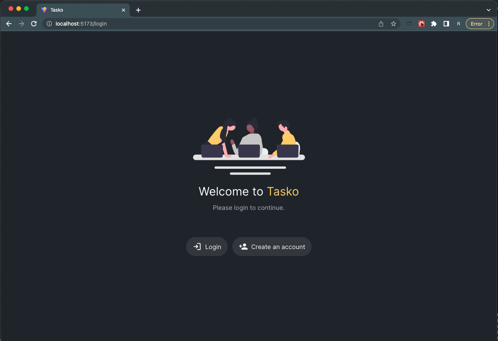
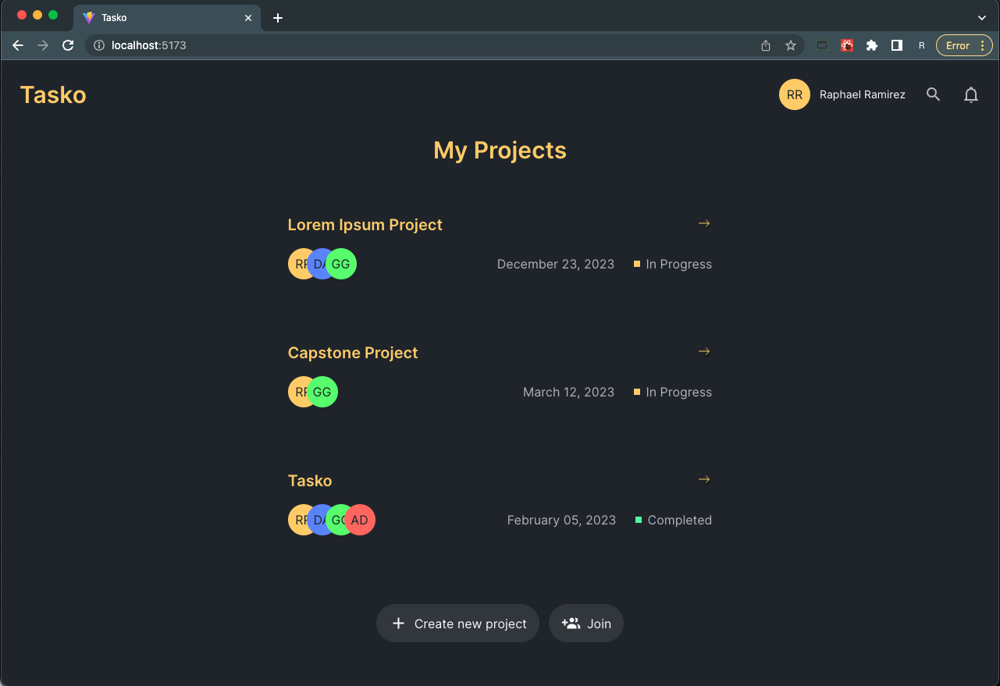
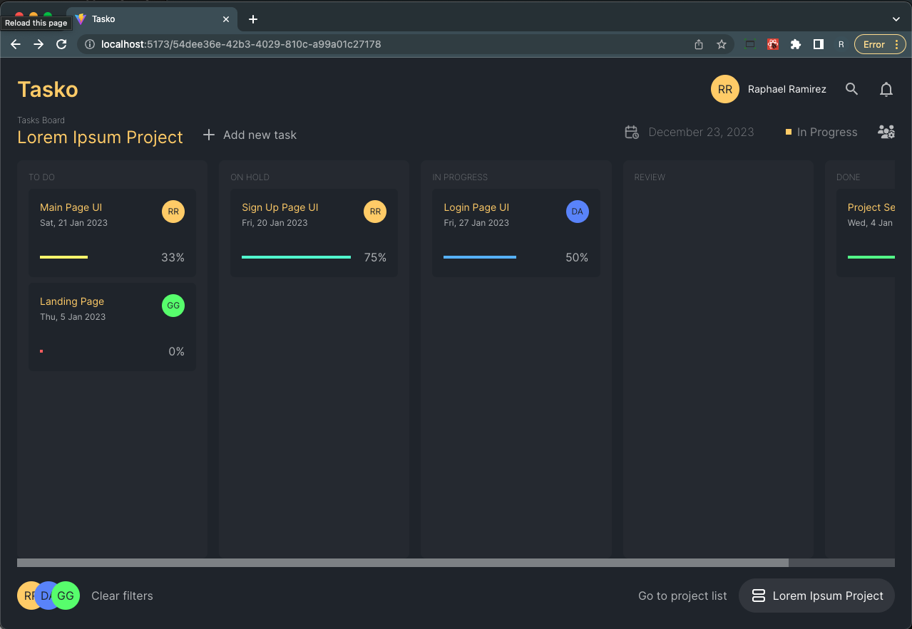
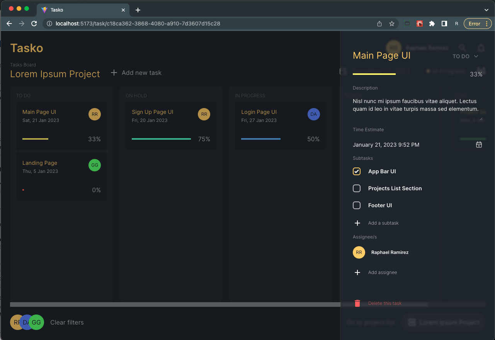

# Tasko

Tasko is a conceptual project management web application. The goal is to create a simple app that helps teams to manage their small projects. 

### Technologies:
Project is created with:
- React 
- TypeScript
- TailwindCSS
- Redux
- and a lot more

# Project Status
The project is still in development.

# Setup
#### Clone the repository
```ssh
$ git clone https://github.com/ramirezraph/tasko-web.git
```
#### To try out the project, you just run it like a typical react application.

```ssh
$ cd tasko-web
$ yarn
$ yarn dev
```

# Screenshots
Note: The project is still in development so everything are heavily subject to changes.

### Login Page


### Projects List Page


### Project Board Page


### Project Board Page - Task

